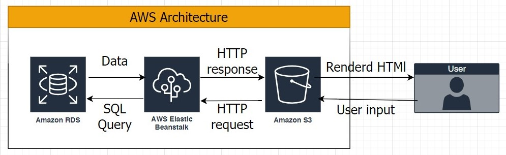

# Infrastructure

I'm using circleci to handle CI/CD and AWS as cloud serves to deploy this project and by these steps :

1.  circleci to handle all automated process.
2.  I used RDS to create and host database
3.  Elastic Beanstalk to create a server that runs and hosts backend code
4.  S3 bucket that hosts static files and frontend code.
