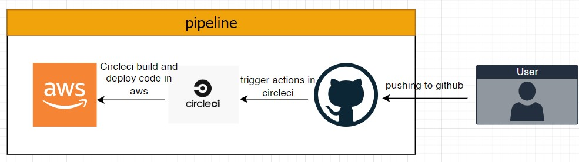

# Pipeline

in this project i'm used github to upload my code to it and circleci to handle all CI/CD and AWS to deploy the application on it.

all process are explained in steps below:

1.  upload the code to **GitHub**
2.  link project repo to **circleci**.
3.  when push the code circleci will do some jobs through workflow

## circleci jobs

`CI jobs`

1. install frontend and backend dependencies.
2. linting frontend code.
3. build frontend and backend.

`CD jobs`
circleci initialize aws-cli and eb-cli and after that:

1. install all dependencies for frontend and backend
2. build both backend and frontend
3. Deploy both frontend and backend

## circleci workflow

1. do build steps that include in CI jobs
2. the workflow here need approval to continue to next step
3. Doing build step that include in CD jobs.
