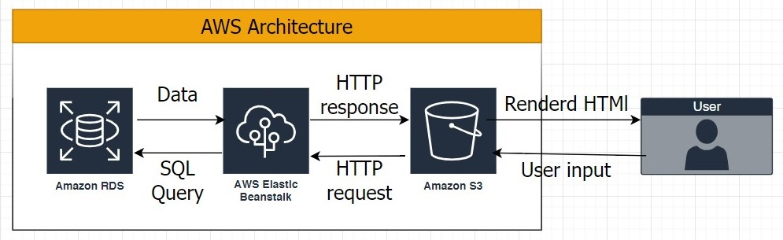

<!-- Please update value in the {}  -->

<h1 align="center">Udagram</h1>

<div align="center">
  <h3>
    <a href="http://moezzat-udagram.s3-website-us-east-1.amazonaws.com">
      Demo
    </a>    
  </h3>
</div>

<!-- TABLE OF CONTENTS -->

## Table of Contents

- [Overview](#overview)
- [infrastructure](./documentation/infrastructure.md)
- [dependencies](./documentation/dependecies.md)
- [pipeline process](./documentation/pipeline.md)
<!-- OVERVIEW -->

## Overview

this is a full stack application deployed in AWS and used circleCI as a CI/CD tool and now this is all services I used at AWS (RDS, AWS Elastic
Beanstalk and S3) and here is architecture that i used for this application



## How to use

1. clone the repo using

```sh
git clone https://github.com/moezzat-git/udagram.git
```
